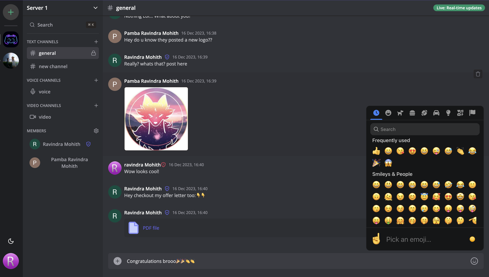

## Fullstack Discord Clone - Real-Time Communication Platform ✨

## Overview

This project is a fully functional clone of Discord, built using the latest web technologies. It offers real-time messaging, audio and video calls, and a highly responsive UI. The app leverages Next.js for server-side rendering, Socket.io for real-time communication, and Prisma for database management.

---



## Features

- **Real-Time Messaging**:
  - Chat with others in real-time using Socket.io.
  - Send attachments as messages using UploadThing.
  - Edit and delete messages in real-time for all users.

- **Channels & Conversations**:
  - Create text, audio, and video call channels.
  - One-on-one conversations between members.
  - One-on-one video calls between members.

- **Member Management**:
  - Manage members with features like kicking, and changing roles between Guest and Moderator.
  - Generate unique invite links with a full invite system.

- **Infinite Loading**:
  - Infinite loading of messages in batches of 10 using TanStack/Query.

- **Server Management**:
  - Create and customize servers with custom settings and member management.

- **Responsive UI**:
  - Fully responsive design using TailwindCSS and ShadcnUI.
  - Supports both light and dark modes.

- **Websocket Fallback**:
  - Fallback to polling with alerts when WebSocket connection fails.

- **Authentication**:
  - Authentication and authorization managed by Clerk.

- **ORM with Prisma**:
  - Uses Prisma as the ORM for database management with MySQL hosted on PlanetScale.

## Tech Stack

### Frontend & Backend:
- **Next.js v13**: A React framework for server-side rendering and generating static websites.
- **Socket.io**: A library for real-time web applications.
- **ReactJS**: A JavaScript library for building user interfaces.
- **TailwindCSS**: A utility-first CSS framework for rapid UI development.

### Database:
- **MySQL**: A relational database hosted on PlanetScale.
- **Prisma**: An ORM for Node.js and TypeScript for interacting with the database.

### Other Tools:
- **Prisma Studio**: A GUI for managing the MySQL database.
- **Clerk**: Authentication and user management service.
- **UploadThing**: Service for handling file uploads.

## Getting Started

### Prerequisites

- **Node.js** (v14.x or higher)
- **MySQL** database (via PlanetScale)
- **Clerk** account for authentication
- **UploadThing** account for managing file uploads

### Installation

1. **Clone the repository**:
    ```bash
    git clone https://github.com/ravindramohith/discord-clone.git
    cd discord-clone
    ```

2. **Install dependencies**:
    ```bash
    npm install
    ```

3. **Set up environment variables**:
    - Create a `.env` file in the root directory with the following variables:
      ```env
      NEXT_PUBLIC_CLERK_FRONTEND_API=your_clerk_frontend_api
      CLERK_API_KEY=your_clerk_api_key
      DATABASE_URL=your_planetscale_mysql_url
      NEXT_PUBLIC_UPLOADTHING_API_KEY=your_uploadthing_api_key
      NEXTAUTH_SECRET=your_nextauth_secret
      ```

4. **Run the development server**:
    ```bash
    npm run dev
    ```

5. **Access the application**:
    - Open your browser and navigate to `http://localhost:3000`.

## Project Structure

### **App Directory (`app/`)**

- **`globals.css`**: Global styles for the application.
- **`layout.tsx`**: Main layout wrapping all pages.
- **`(auth)/`**: Contains routes for sign-in and sign-up.

### **Middleware (`middleware.ts`)**
- Handles request processing and authentication.

### **Types (`types.ts`)**
- TypeScript types used across the project for strong typing.

### **Components Directory (`components/`)**
- Reusable UI components for building the user interface.

## Key Features

- **Real-Time Communication**: Chat, call, and share media in real-time with other users.
- **Custom Channels**: Create and manage custom text, audio, and video channels.
- **Member Management**: Control access and permissions for each member in your server.
- **Authentication**: Secure user authentication with Clerk.
- **ORM with Prisma**: Manage database operations seamlessly with Prisma and PlanetScale.
- **Responsive Design**: Enjoy a seamless experience across devices with a responsive UI.

## Deployment

### Deployment on AWS EC2

This project is deployed on an **AWS** EC2 instance using **GitHub Actions** through **CI/CD pipeline**. The deployment pipeline is triggered on every push to the `production` branch. The workflow includes building a Docker image, pushing it to DockerHub, and then pulling and running it on the EC2 instance.

You can view the details of the workflow and its execution [here](https://github.com/ravindramohith/discord-clone/actions).


## Contributing

Contributions are welcome! Please fork the repository and submit a pull request.

